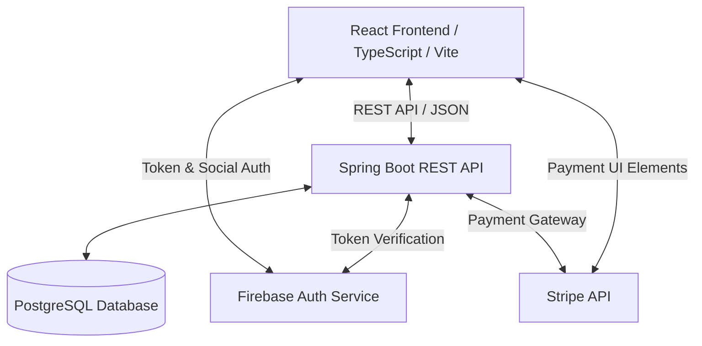
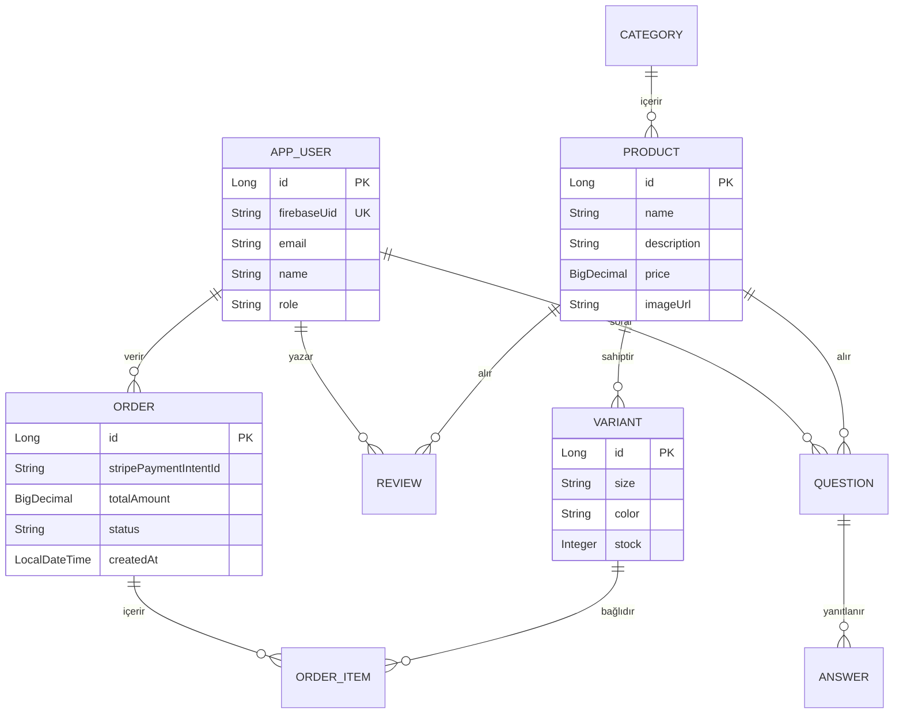

# SHOEVAULT E-TİCARET WEB UYGULAMASI PROJE RAPORU

---

## ÖN YÜZ (KAPAK BİLGİLERİ)

**Kurum:** T.C. İstanbul Topkapı Üniversitesi  
**Proje Başlığı:** Shoevault E-Ticaret Platformu Geliştirme Projesi  
**Ders Adı:** Web Programlama Proje Ödevi  
**Öğrenci Adı Soyadı:** Tuncay Çavuşoğlu  
**Öğrenci Numarası:** 25221602011  

**Proje GitHub Bağlantıları:**
*   **Önyüz (Frontend) Deposu:** [https://github.com/tuncaycavusoglu/ecommerce](https://github.com/tuncaycavusoglu/ecommerce)
*   **Arkayüz (Backend) Deposu:** [https://github.com/tuncaycavusoglu/backendEcommerce](https://github.com/tuncaycavusoglu/backendEcommerce)

**İmza:**  
\
\
`_____________________________________`  
*Tuncay Çavuşoğlu (İmza)*


---

## İÇİNDEKİLER
1. Özet ve Proje Amacı
2. Sistem Mimarisi ve Teknoloji Yığını
3. Veritabanı ve Veri Modeli Tasarımı
4. Arkayüz (Backend) Bileşenleri ve Kod Tasarımı
5. Önyüz (Frontend) Bileşenleri ve Kod Tasarımı
6. Entegrasyonlar (Firebase, Stripe)
7. Sonuç ve Değerlendirme

---

## 1. ÖZET VE PROJE AMACI
Bu proje; modern web standartlarına uygun, ölçeklenebilir, güvenli ve performans odaklı bir **E-Ticaret Web Uygulaması** (Shoevault) tasarımı ve kodlamasını içermektedir. Sistem, kullanıcıların ayakkabı ürünlerini inceleyebileceği, sepetlerine ekleyebileceği, güvenli ödeme yapabileceği, sipariş takibi yürütebileceği, ürünlere yorum bırakıp soru-cevap bölümünden satıcıyla etkileşime girebileceği uçtan uca dinamik bir platform sunar. Aynı zamanda gelişmiş bir yönetici (Admin) paneli üzerinden stok kontrolü, ürün ekleme ve sipariş yönetimi imkanı sağlamaktadır.

---

## 2. SİSTEM MİMARİSİ VE TEKNOLOJİ YIĞINI

Sistem, modern yazılım mühendisliği prensiplerine uygun olarak **Ayrık İstemci-Sunucu (Decoupled Client-Server)** mimarisiyle tasarlanmıştır.



### Kullanılan Teknolojiler:
*   **Önyüz (Frontend):** React (TypeScript), Vite (Derleyici), Tailwind CSS / Vanilla CSS, Firebase SDK, Stripe Elements.
*   **Arkayüz (Backend):** Java, Spring Boot, Spring Security (JWT / Firebase Filter), Spring Data JPA.
*   **Veritabanı:** PostgreSQL (İlişkisel Veritabanı Yönetim Sistemi).
*   **Dış Entegrasyonlar:** Firebase Authentication (Kullanıcı Yönetimi), Stripe (Güvenli Ödeme Geçidi).

---

## 3. VERİTABANI VE VERİ MODELİ TASARIMI
Projede verilerin tutarlılığı, bütünlüğü ve ilişkisel ilişkilerin sağlıklı kurulabilmesi amacıyla **PostgreSQL** veritabanı üzerinde katmanlı bir ER şeması tasarlanmıştır. Temel tablolar ve aralarındaki ilişkiler şu şekildedir:



*   **Ürün ve Varyant İlişkisi:** Bir ürünün (Product) birden fazla rengi ve numarası (Variant) olabilir. Stok yönetimi doğrudan varyant bazında takip edilmektedir.
*   **Sipariş Yapısı:** Siparişler (Order) ve sipariş kalemleri (OrderItem) 1:N ilişkisiyle bağlanmıştır. Sipariş kalemi doğrudan belirli bir ürün varyantını (Variant) referans alır.

---

## 4. ARKAYÜZ (BACKEND) BİLEŞENLERİ VE KOD TASARIMI

Spring Boot projesi **Katmanlı Mimari (Layered Architecture)** yaklaşımıyla geliştirilmiştir. Yazılım katmanları şunlardır:

### A. Denetleyici Katmanı (Controllers)
İstemciden gelen HTTP isteklerini karşılayan, JSON serileştirmesini gerçekleştiren ve ilgili servis katmanına yönlendiren katmandır.
*   `AuthController`: Firebase üzerinden kimliği doğrulanmış kullanıcıyı yerel veritabanıyla senkronize eder.
*   `ProductController` & `CategoryController`: Ürünleri filtreleme, sıralama ve kategori bazlı listeleme uç noktalarını sunar.
*   `OrderController` & `PaymentController`: Sepet onaylama, Stripe Payment Intent oluşturma ve sipariş kaydı oluşturma işlemlerini yönetir.
*   `ReviewController` & `QuestionController`: Yorum yapma, yıldız verme ve soru-cevap işlemlerini yönetir.

### B. Servis Katmanı (Services)
İş kurallarının ve mantıksal işlemlerin yürütüldüğü katmandır.
*   **Stok Doğrulama (`OrderService`):** Sipariş oluşturulmadan önce seçilen ürün varyantının yeterli stokta olup olmadığını kontrol eder. Stok yetersiz ise `@Transactional` anotasyonu sayesinde tüm işlem geri alınır (rollback) ve hata fırlatılır.
*   **Stripe Entegrasyonu (`PaymentService`):** Toplam tutarı Stripe API'sine göndererek ödeme oturumu ve geçici ödeme niyeti (Payment Intent) oluşturur.

### C. Depo Katmanı (Repositories)
Veritabanı işlemlerini yürüten ve SQL sorgularını soyutlayan `JpaRepository` arayüzleridir. `VariantRepository` ve `ProductRepository` gibi yapılar kullanılarak özel sorgular (Custom Queries) optimize edilmiştir.

---

## 5. ÖNYÜZ (FRONTEND) BİLEŞENLERİ VE KOD TASARIMI

React önyüz projesi, modüler bileşen yapısı ve TypeScript'in tip güvenliği prensipleriyle tasarlanmıştır.

### A. Context Yapısı ve Global Durum Yönetimi
*   `AuthContext.tsx`: Firebase SDK ile entegre çalışarak kullanıcının oturum açma (login), kayıt olma (register) ve oturumu kapatma durumlarını global düzeyde yönetir. Firebase Token yenilendiğinde bunu otomatik algılar ve backend isteklerinde Header'a yerleştirir.

### B. Sayfalar ve Kullanıcı Arayüzü (Pages)
*   **CheckoutPage.tsx (Ödeme Sayfası):** Stripe Elements kütüphanesini barındırır. Kart bilgilerini doğrudan Stripe sunucularına güvenli bir şekilde aktarır, sunucudan dönen token ile backend tarafında siparişi onaylar.
*   **ProductDetailPage.tsx (Ürün Detay):** Kullanıcı varyant seçimi yapar, stok durumunu anlık gözlemler, yorumları ve değerlendirme puanlarını inceler.
*   **AdminPage.tsx (Yönetim Paneli):** Yetkili kullanıcıların yeni ürün/varyant ekleyebileceği, mevcut ürünlerin stoklarını güncelleyebileceği dinamik kontrol panelidir.

---

## 6. ENTEGRASYONLAR

### A. Firebase Authentication Entegrasyonu
Backend projesindeki `FirebaseTokenFilter.java` adlı filtre sınıfı, istemciden gelen her güvenli HTTP isteğinin `Authorization: Bearer <TOKEN>` başlığını yakalar. Firebase Admin SDK kullanarak token'ın doğruluğunu onaylar ve Spring Security Context'ine kullanıcıyı kaydeder.

```java
// FirebaseTokenFilter.java Örneği
FirebaseToken decodedToken = FirebaseAuth.getInstance().verifyIdToken(token);
String uid = decodedToken.getUid();
// Spring Security Context entegrasyonu
UsernamePasswordAuthenticationToken authentication = new UsernamePasswordAuthenticationToken(user, null, authorities);
SecurityContextHolder.getContext().setAuthentication(authentication);
```

### B. Stripe Ödeme Geçidi Entegrasyonu
Güvenli ödeme akışı şu şekilde tasarlanmıştır:
1. Kullanıcı sepetteki ürünleri onaylar.
2. Önyüz, backend'deki `/api/payments/create-payment-intent` ucuna sepet içeriğini gönderir.
3. Backend veritabanından fiyatları kontrol eder, Stripe API ile görüşüp bir `clientSecret` anahtarı üretir ve önyüze döner.
4. Önyüz, Stripe Elements kart formunu bu anahtarla yükler ve kullanıcı kart bilgisini girip onayladığında ödeme doğrudan Stripe üzerinde tahsil edilir.

---

## 7. SONUÇ VE DEĞERLENDİRME
Bu projede Spring Boot ve React mimarileri kullanılarak, endüstri standardı teknolojilerle (OAuth2/Firebase, Stripe) donatılmış, kararlı ve güvenli çalışan bir e-ticaret platformu başarıyla hayata geçirilmiştir. Katmanlı mimari yaklaşımı kodun bakımını kolaylaştırırken, TypeScript entegrasyonu çalışma zamanı hatalarını en aza indirgemiştir. Proje gereksinimlerinde belirtilen tüm temel ve gelişmiş bileşenler tasarlanmış, kodlanmış ve GitHub depolarına yüklenerek kullanıma sunulmuştur.
